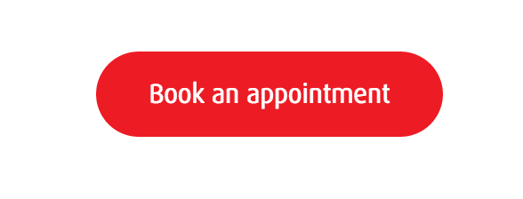
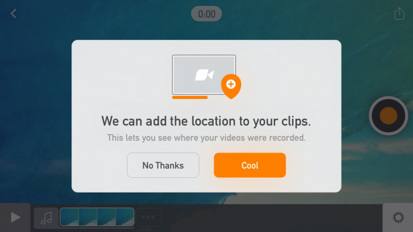

#The Evolution of Buttons in UX Design
Buttons are a crucial part of designing interfaces. Getting this element right will go a long way toward good UX and elegant design. At their most basic, buttons are specially styled links that we want to draw attention to. Buttons can link us to other pages, complete an action like submitting a form or making a purchase. They are often used for the primary calls to action (CTA) we want our users to complete.
###A brief history of buttons in UX
With the advent of graphical user interfaces (GUIs) came button elements. Let’s pick up in the early 90s, when we start to see what resemble buttons on web 1.0 sites and on interfaces such as Windows 3.11 and later Windows 95.
 
 

Buttons in the early days of the web were often GIF buttons or graphics. These buttons contained blinking graphics and textures. At this time, much web content was user generated and best practices in terms of usability and affordances had not developed.
Operating system buttons relied on the appearance of relief and shadow to distinguish them from their surrounding context, as they were often the same color as the dialog box or interface element they were placed in.

 
 
Early OS buttons were often the same color as the surrounding dialogue boxes. Image source.
This type of skeuomorphic button which relied on looking raised and 3D to imply it was a clickable element spilled over into the web. There are still examples of the legacy of this type of button to be found online today, particularly when legacy backend systems are in play. Gradients, outlines and shadows are all examples of this.

 
 
###Modern button trends
We have come a long way since the early days of button design. One of the major shifts that has happened in UI terms is the trend away from skeuomorphic elements towards more flat ones, stripped of 3D effects. Rather than relying on buttons looking raised and ‘buttony’, lots of modern web design aims for a clean, minimal aesthetic. The challenge here is keeping affordances – if everything is flat, how do users know which pieces are buttons?

 

Material design comes in here, reintroducing some elements of layers, hierarchy and animation to provide the user with cues. These buttons are layered over the top of the interface. A further evolution is the floating action button (FAB) – which ‘float’ above the UI and draw attention to promoted or primary actions. FABs have drawn some criticisms for potentially impeding the user experience. They are an overlapping element and could potentially get in the way. Users may be becoming familiar with them as Google introduces them across Android and web interfaces, however, as always, use with caution and be sure to test your design decisions!
Another button style that has become quite popular of late is the ‘ghost button’. This is a transparent button, with an outline a few pixels thick and button text matching the outline colour. These buttons are driven by aesthetics, as they are an elegant way to create a cohesive feeling. To ensure that the CTA is noticed, these buttons are often centered with lots of padding around them. The buttons also usually have very strong, inverse hover/mouse over states, to ensure the affordances are sufficient.
    
 
 
Ghost buttons blend nicely with the background of the design. 
     
 
 
      
Strong hover states for ghost buttons provide better affordances. 
A final trend that is gaining traction is the oval button. This an alternative to traditional rectangular or rounded rectangular buttons, and adds visual interest. These are usually solid fill styled buttons, again supported by strong hover and tap states to ensure users can identify them as buttons.
    
 
 
      
Oval buttons are becoming increasingly popular. 

#Button best practices
While trends and visual direction are important to be aware of, the button is primarily a functional element. It is crucial that users can identify them quickly and easily as buttons. Let’s explore some best practices to keep in mind when designing buttons.

###1. Make it look like a button
 
 
Groupon.ca sign in uses a subtle gradient to create button affordance for the primary ‘sign in’ CTA. Notice how secondary actions are not styled as buttons, for example ‘Not a member yet?’. This keeps the focus on the primary action.
Think about how the design communicates affordance. How do users understand the element as a button? Size, shape and placement all come into play here. Classic button shapes include the rounded rectangle. Some research suggests that rounded corners enhance information processing and draw our eyes to the centre of element. As mentioned above, one current trend is to use oval buttons. If you choose to deviate from traditional button shapes, make sure you usability test your designs to ensure that people can easily identify the buttons.
Make sure you also consider the hover/tap states and active states of the button. Bear in mind that these states should provide enough contrast for people to clearly identify them as different from the default state.

###2. Pay attention to sizing
  
  
Think carefully about touch target size and padding when designing.
The size of buttons also play a key role in helping users to identify these elements. With the rise of responsive web, thinking about how the button will resize and percentage widths of buttons has become more important. As web visits from mobile devices continues to rise, we need to ensure that the buttons we design are large enough for people to interact with. This means considering the size of button elements as well as the padding between clickable elements. Various platforms provide guidelines on minimum touch targets. Results of an MIT Touch Lab study found that averages for finger pads are between 10-14mm and fingertips are 8-10mm. The best way to test out your design is to look at them at scale on devices, and get users to interact with them. There is also a great Touch Target Template that can guide you.

###3. Order of buttons
   
   
Vee for video – notice how the primary action is stronger in colour and contrast, and is on the right hand side of the modal. Image credit: pttrns.com
The order that buttons go in, especially if there are corresponding pairs (such as ‘previous’ and ‘next’) is important. A few rules of thumb can help here. Ensure the design puts emphasis on the primary or most important action. This should be the visually dominant button. This can be done using color or size. Be sure to follow platform conventions for modals, as users will be used to seeing a certain button order and placement. You can find these guidelines online for all of the major platforms.
 
  
